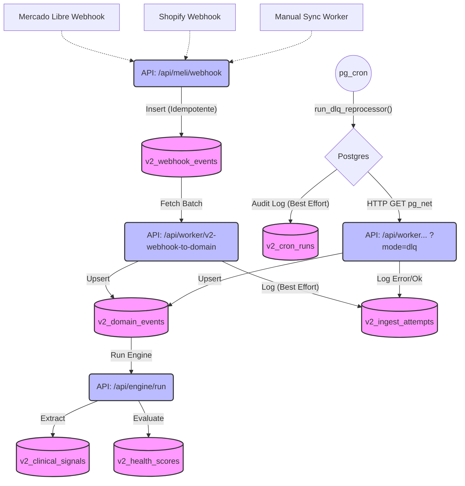

# Pipeline Clínico V2 (Historical Reference)

> **Estado documental:** este archivo describe el pipeline físico de V2 como **referencia histórica**.
> La base operativa activa del sistema es V3.
> Ver: [V3 Pipeline Status](../status/V3_PIPELINE_READY.md) | [V3 Read Model Pattern](./V3_READ_MODEL_PATTERN.md)

**V3 activo — superficies read-only cerradas:**

| Endpoint | Estado |
|---|---|
| `GET /api/v3/clinical-status` | ✅ CLOSED |
| `GET /api/v3/run-history` | ✅ CLOSED |
| `GET /api/v3/store-pulse` | ✅ CLOSED |
| `/v3/internal/store-pulse` UI interna | ✅ ACTIVE |

**V2:** estabilización operativa únicamente. Sin expansión estructural.

Este documento describe la arquitectura y el flujo físico de datos desde la recepción de eventos externos hasta la generación de scores clínicos, consolidando las decisiones de observabilidad y resiliencia (ADR-004, ADR-005, ADR-006, ADR-007).

## Flujo de Ingesta y Motor Clínico

El pipeline es **estrictamente de un solo sentido (unidireccional), append-only y event-driven**.
Se basa en Postgres como cola persistente (FV) y Next.js Workers para computo.

### Componentes Clave

1. **`v2_webhook_events`**: Tabla bruta, conserva el payload original del proveedor. **Idempotencia** garantizada vía `provider_event_id`.
2. **`v2-webhook-to-domain` (Worker Normal)**: Lee webhooks no procesados y los normaliza. Escribe un `domain_event` e inserta el resultado (éxito o error) en `v2_ingest_attempts`. Cardinalidad garantizada `1:1`.
3. **`v2-webhook-to-domain?mode=dlq` (Worker DLQ)**: Lee vía consulta SQL los eventos registrados en `v2_ingest_attempts` como 'error', sin un domain event creado, menores a 10 reintentos y que cuenten con un cooldown de 10 min.
4. **`pg_cron` y `v2_cron_runs`**: Supabase dispara `run_dlq_reprocessor()` en Postgres cada 10 minutos. Esta función manda un request HTTP con `pg_net` al *Worker DLQ*. La tabla `v2_cron_runs` ofrece visibilidad directa si este job funcionó, para auditar silencios operativos (append-only).
5. **Capa Clínica (`v2_clinical_signals` / `v2_health_scores`)**: Se nutre de los Domain Events limpios para evaluar la fisiología de la tienda de forma inmutable.

> **Regla de Oro**: Jamás mutar la historia logueada en las tablas con formato append-only. Tampoco tocar payload bruto. Todo error debe remediarse actualizando la lógica en el Worker.
